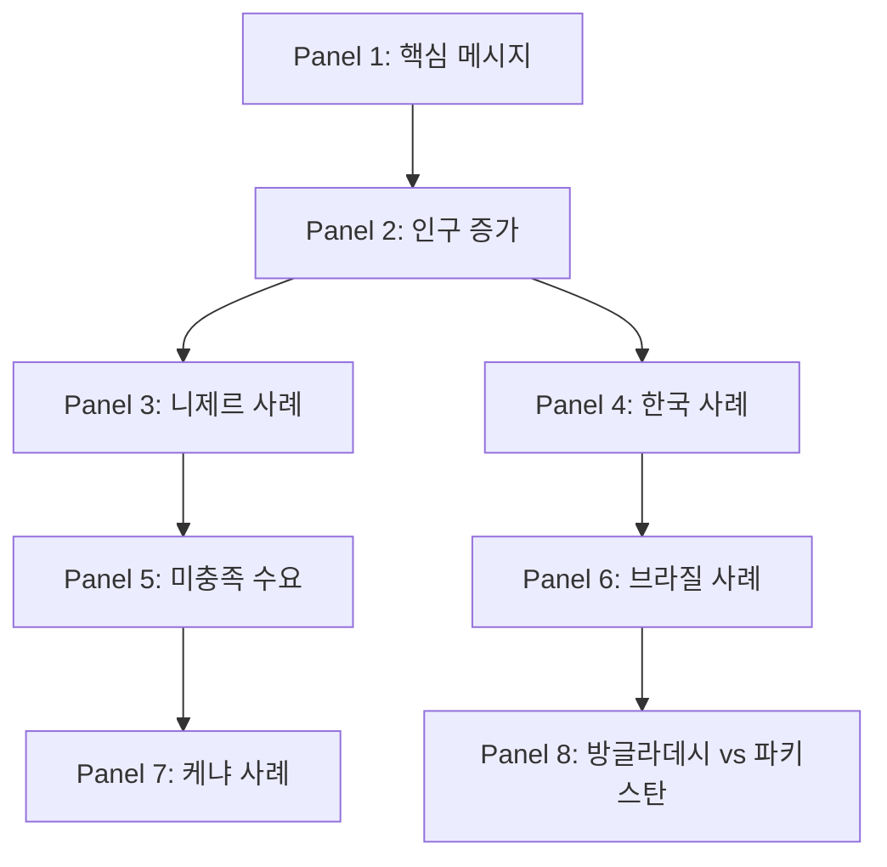

# 📊 "Family Planning: The Unfinished Agenda" 발제 기획안

## 📌 발제 개요
- **논문**: Family planning: the unfinished agenda (Lancet 2006)
- **저자**: John Cleland 외 5명
- **발표 시간**: 약 30-40분
- **핵심 메시지**: 가족계획은 빈곤 감소, 모성·아동 사망률 감소, 여성 권한 강화, 환경 지속가능성에 기여하는 독특한 의료 개입

---

## 🔑 Part 1: 핵심 개념 이해 (5분)

### 1.1 가족계획(Family Planning)의 정의
- **의료적 개입**: 피임법 제공 및 교육
- **사회적 개입**: 소가족 규범 확산, 여성 권한 강화
- **정책적 개입**: 인구 안정화, 경제 발전 도모

### 1.2 주요 지표 설명
| 지표 | 의미 | 목표 수준 |
|------|------|----------|
| **TFR (Total Fertility Rate)** | 여성 1인당 평균 출산 자녀 수 | 2.1 (인구 대체 수준) |
| **CPR (Contraceptive Prevalence Rate)** | 피임 실천율 | 60% 이상 |
| **Unmet Need** | 가족계획 미충족 수요 | 10% 미만 |
| **MMR (Maternal Mortality Ratio)** | 모성 사망률 | 70/100,000 미만 |

### 1.3 MDGs와의 연관성
- **MDG 1**: 빈곤 퇴치
- **MDG 3**: 성평등 및 여성 권한 강화
- **MDG 4**: 아동 사망률 감소
- **MDG 5**: 모성 건강 개선
- **MDG 7**: 환경 지속가능성

---

## 🌍 Part 2: 시간순 스토리텔링 (10분)

### 📅 Timeline: 가족계획의 역사적 전개

#### **1960년대: 시작 - 두 가지 경로의 탄생**
- **아시아 모델 (정부 주도)**:
  - 인도 (1952): 세계 최초 국가 가족계획 프로그램
  - 한국 (1962): 경제개발 5개년 계획과 연계
  - 중국 (1964): 인구 억제 정책 시작
  - 동기: 급속한 경제 성장을 위한 인구 통제

- **라틴아메리카 모델 (NGO 주도)**:
  - 콜롬비아, 멕시코: 불법 낙태로 인한 모성 사망 급증 대응
  - 브라질: 민간 클리닉 네트워크 확산
  - 동기: 공중 보건 위기 대응

- **확산 속도**: 1960년 2개국 → 1975년 74개국 채택

#### **1970-1980년대: 황금기 - 급속한 확산과 성과**
- **국제 자금 지원 급증**:
  - 1971년: $168M (USAID 주도)
  - 1985년: $512M (피크, 세계은행 참여)
  - UNFPA 설립 (1969): UN 차원 지원 시작

- **극적인 성과**:
  - 피임 실천율: <10% → 60% (태국, 한국)
  - 출산율: 6.0 → 3.0 (동아시아 평균)
  - 인구 증가율: 2.5% → 1.7% (연간)

- **어두운 그림자**:
  - 인도: 1976-77 강제 불임시술 (800만 명)
  - 중국: 1979 한자녀 정책 시작
  - 인권 침해 논란 → 국제사회 비판

#### **1994년: 카이로 전환점 - 패러다임의 대전환**
- **ICPD (국제인구개발회의) 합의**:
  - 179개국 참가, 20년 행동계획 채택
  - 핵심 전환: "인구 목표" → "개인 권리"
  - 새로운 개념: 생식 건강 (Reproductive Health)

- **주요 원칙**:
  - 여성의 자기결정권 (Autonomy)
  - 남녀 평등과 여성 권한 강화
  - 청소년 생식 건강 서비스
  - 안전한 임신과 출산의 권리

- **예상치 못한 결과**:
  - 가족계획 특화 프로그램 약화
  - 통합적 접근의 복잡성 증가

#### **1995-2005년: 위기의 10년 - 잊혀진 의제**
- **자금 지원 붕괴**:
  - 1995년: $560M (카이로 직후 최고점)
  - 2000년: $520M (정체)
  - 2003년: $460M (18% 감소)
  - 미국 Mexico City Policy 부활 (2001)

- **MDGs의 실수**:
  - 8개 목표 중 가족계획 직접 언급 없음
  - 모성 건강 (MDG 5)에 부분 포함
  - 측정 지표에서 피임 실천율 제외

- **HIV/AIDS 우선순위화**:
  - PEPFAR: $15B (2003-2008)
  - Global Fund: $10B 연간
  - 가족계획: $460M (3% 수준)

#### **2006년 (논문 시점): 위기 인식과 재평가**
- **아프리카의 시한폭탄**:
  - 사하라 이남: TFR 5.5, CPR 17%
  - 니제르: TFR 7.5, 2050년 인구 3배 예상
  - 청년 인구 폭증: 15-24세 2배 증가 예상

- **재활성화 필요성**:
  - MDGs 달성 불가능 경고
  - 빈곤 감소 정체 우려
  - 환경 지속가능성 위협

---

## 📊 Part 3: 8개 패널 내용 시계열 분석 (10분)

### Panel 구조와 논리적 흐름



### 📋 각 패널의 상세 분석

#### **Panel 1: 핵심 메시지 - 가족계획의 독특한 가치**
- **주장**: "가족계획은 빈곤, 모성·아동 사망, 성평등, 환경에 동시 기여하는 독특한 개입"
- **주요 데이터**:
  - 모성 사망 감소: 32% (2005년 기준)
  - 아동 사망 감소: 10%
  - 빈곤 감소 효과: 0.9-2.3 자녀 감소 시 20% 빈곤 감소
  - HIV 전파 감소: 75-80%
- **시사점**: 다른 개입과 달리 multiple benefits

#### **Panel 2: 인구 증가 예측 (1960-2050)**
- **1960년**: 30억 명 (개발도상국 20억)
- **2005년**: 65억 명 (개발도상국 52억)
- **2050년 예상**:
  - 전체: 92억 명
  - 사하라 이남 아프리카: 17억 → 34억 (2배)
  - 선진국: 정체 또는 감소
- **핸심 이슈**: 아프리카 중심 인구 폭발

#### **Panel 3: 니제르 - 최악의 시나리오**
- **현재 상황 (2005)**:
  - TFR: 7.5 (세계 최고)
  - CPR: 4.6% (세계 최저)
  - 인구: 1,400만 명
- **2050년 예측**:
  - 인구: 5,300만 명 (3.8배 증가)
  - 농지 부족: 1인당 0.7ha → 0.2ha
  - 교육/의료 시스템 붕괴
- **시사점**: 가족계획 없이 개발 불가능

#### **Panel 4: 한국 - 극적인 성공 사례**
- **1960년대**:
  - TFR: 6.0, CPR: <10%
  - 1인당 GDP: $158
- **1980년대**:
  - TFR: 2.8, CPR: 60%
  - 경제성장률: 연 8-10%
- **2005년**:
  - TFR: 1.2 (초저출산)
  - CPR: 80%
  - 1인당 GDP: $16,000
- **시사점**: 가족계획과 경제발전 동반 상승

#### **Panel 5: 미충족 수요 - 장벽 분석**
- **접근성 장벽 (60%)**:
  - 서비스 부재: 농촌/외딴 지역
  - 의료인 부족: 아프리카, 남아시아
  - 공급망 문제: 재고 부족, 유통 문제
- **태도 장벽 (20%)**:
  - 가족/남편 반대
  - 종교적 신념
  - 부작용 두려움
- **지식 장벽 (20%)**:
  - 피임법 모름
  - 잘못된 정보
- **해결책**: 다각적 접근 필요

#### **Panel 6: 브라질 - 정부 개입 없는 변화**
- **1960년대**: TFR 6.2, CPR <20%
- **1970-80년대**:
  - TV 보급: 5% → 74%
  - 텔레노벨라 영향: 소가족 규범 확산
  - 민간 약국 네트워크 확대
- **1996년**: TFR 2.5, CPR 77%
- **성공 요인**:
  - 대중매체 영향
  - 의료 시설 접근성 개선
  - 여성 교육 향상
- **시사점**: Bottom-up 변화 가능

#### **Panel 7: 케냐 - 정치적 의지의 부침**
- **황금기 (1967-1990)**:
  - 대통령 직접 지원 (Kenyatta, Moi)
  - TFR: 8.0 → 6.5
  - CPR: 7% → 27%
- **정체기 (1990-2000)**:
  - 정치적 의지 약화
  - 자금 감소
  - CPR 정체: 33%
- **위기 (2000-2004)**:
  - 공공 의료 시스템 붕괴
  - 재고 부족 만성화
  - TFR 재상승: 4.8
- **시사점**: 지속적 정치적 의지 필수

#### **Panel 8: 방글라데시 vs 파키스탄 - 분단의 결과**
- **1971년 (출발점)**:
  - 두 국가 모두 파키스탄의 일부
  - TFR: 6.9 (동일)
  - CPR: <5% (동일)
- **방글라데시 (1975-2005)**:
  - 독립 후 즉시 가족계획 강화
  - Matlab 실험 (1977): 커뮤니티 기반 접근
  - 2005년: TFR 3.0, CPR 58%
- **파키스탄 (1975-2005)**:
  - 종교적 반대와 정치적 무관심
  - 군사 정부 하 프로그램 약화
  - 2005년: TFR 4.0, CPR 28%
- **2050년 예상 인구**:
  - 방글라데시: 2.4억 (1.5배)
  - 파키스탄: 3.5억 (2배)
- **시사점**: 정책 선택의 장기적 영향

---

## 🗺️ Part 4: 지역별 데이터 시각화 (10분)

### 4.1 세계 지도 기반 시각화

#### **인구 증가율 맵핑 (2005-2050)**
```
🟥 높음 (≥2% 연간): 사하라 이남 아프리카
🟨 중간 (1-1.9%): 북아프리카, 중동, 남아시아
🟩 낮음 (<1%): 동아시아, 라틴아메리카
🟦 감소: 유럽, 일본
```

#### **피임 실천율 (CPR) 지도**
```
국가별 CPR 수준:
- 🟢 높음 (>60%): 중국, 태국, 브라질
- 🟡 중간 (30-60%): 인도, 인도네시아, 이집트
- 🔴 낮음 (<30%): 니제르, 차드, 말리
```

### 4.2 주요 국가 비교 대시보드

#### **종합 비교 지표 (2005년 기준)**
| 국가 | 인구(백만) | TFR | CPR(%) | 미충족수요(%) | MMR | 2050 예상 |
|------|-----------|-----|--------|---------------|-----|-----------|
| **니제르** | 14 | 7.5 | 4.6 | 30+ | 1,800 | 53백만 (3.8배) |
| **케냐** | 35 | 4.8 | 39 | 24 | 560 | 85백만 (2.4배) |
| **방글라데시** | 142 | 3.0 | 58 | 16 | 320 | 243백만 (1.7배) |
| **파키스탄** | 158 | 4.0 | 28 | 32 | 320 | 349백만 (2.2배) |
| **브라질** | 186 | 2.5 | 77 | 6 | 110 | 253백만 (1.4배) |
| **한국** | 48 | 1.2 | 80 | <10 | 14 | 42백만 (0.9배) |
| **인도** | 1,103 | 2.9 | 56 | 16 | 450 | 1,658백만 (1.5배) |
| **중국** | 1,304 | 1.8 | 87 | 2 | 45 | 1,437백만 (1.1배) |

#### **지역별 격차 분석**
- **최고 성과국**: 동아시아 (한국, 중국)
- **중간 전환국**: 남미 (브라질), 남아시아 (방글라데시)
- **도전 직면국**: 남아시아 (파키스탄), 동아프리카 (케냐)
- **위기 상황국**: 서아프리카 (니제르)

### 4.3 동적 시각화 시나리오

#### **시간대별 변화 애니메이션 (1960-2050)**
```
📍 1960년: 시작
- 동아시아: 한국, 대만 시작 (TFR 6.0)
- 남아시아: 인도 프로그램 개시
- 서구: 무관심

📍 1975년: 확산
- 동남아시아: 태국, 인도네시아 참여
- 라틴아메리카: 멕시코, 브라질 NGO 활동
- 아프리카: 케냐 최초 시작

📍 1990년: 전환
- 아시아: TFR 3.0 달성 (태국, 한국)
- 라틴아메리카: 급속한 출산율 감소
- 아프리카: 정체 시작

📍 2005년: 양극화
- 선진국: 초저출산 (TFR <1.5)
- 중진국: 대체수준 근접 (TFR 2.1-3.0)
- 최빈국: 높은 출산율 유지 (TFR >5.0)

📍 2050년: 예측
- 아프리카: 전 세계 인구 증가의 90% 차지
- 아시아: 인구 감소 시작
- 유럽: 급속한 고령화
```

#### **인터랙티브 요소 설계**
1. **클릭 가능한 국가**: 상세 데이터 팝업
2. **시간 슬라이더**: 연도별 변화 확인
3. **지표 선택**: TFR, CPR, MMR 전환
4. **비교 모드**: 2-4개국 동시 비교
5. **시나리오 전환**: 현상유지 vs 개입강화

---

## 💰 Part 5: 자금과 정책 분석 (5분)

### 5.1 국제 원조 흐름
```
1971년: $168M
   ↓
1985년: $512M (피크)
   ↓
1995년: $560M
   ↓
2003년: $460M (감소)
   ↓
2006년 필요: 아프리카만 $270M (실제: $113M)
```

### 5.2 비용-효과 분석
- **가족계획 $1 투자 시**:
  - 모성·신생아 의료비 $3 절감
  - 교육 비용 감소
  - 빈곤 감소 가속화

### 5.3 정책 권고사항
1. **국제 수준**
   - MDGs에 가족계획 명시적 포함
   - 유럽 국가들의 리더십 필요
   - 세계은행, Gates Foundation 참여

2. **국가 수준**
   - 고위급 정치적 의지
   - 엘리트 그룹 지지 연합
   - 대중매체 활용

3. **프로그램 수준**
   - 다양한 피임법 제공
   - 의료시설, 사회마케팅, 지역사회 접근
   - 장벽 제거 (의료화 해제)

---

## 🎯 Part 6: 핵심 논쟁과 결론 (5분)

### 6.1 주요 논쟁점
| 논쟁 | 비판 | 반박 |
|------|------|------|
| **강압성** | 과거 아시아 프로그램의 강압 | 권리 기반 접근 가능 |
| **문화적 저항** | 전통적 가치관 충돌 | 케냐, 방글라데시 성공 사례 |
| **빈곤층 필요** | 노동력, 노후 보장 | 미충족 수요가 더 높음 |
| **HIV/AIDS 우선** | 더 시급한 보건 문제 | 가족계획이 더 큰 영향 |

### 6.2 핵심 메시지 재강조
1. **독특한 다면성**: 빈곤, 건강, 교육, 환경 동시 해결
2. **증명된 효과성**: 40년간의 성공 경험
3. **미완의 과제**: 아프리카 중심 재투자 필요
4. **정치적 의지**: 기술이 아닌 의지의 문제

### 6.3 2050년 시나리오
- **시나리오 A (현상 유지)**:
  - 아프리카 인구 2배
  - MDGs 달성 실패
  - 환경 위기 심화

- **시나리오 B (가족계획 강화)**:
  - 모성 사망 32% 감소
  - 아동 사망 10% 감소
  - 빈곤 감소 가속화

---

## 📚 발표 자료 구성

### 슬라이드 상세 구성 (총 30장)

#### **Section 1: 도입부 (3장)**
1. **제목 슬라이드**
   - 제목: "Family Planning: The Unfinished Agenda"
   - 부제: "가족계획이 MDGs 달성과 지속가능발전에 미치는 영향"
   - 발표자, 날짜, Lancet 2006 출처

2. **목차 및 학습목표**
   - 6개 Part 구조 소개
   - 핵심 질문 3개 제시
   - 예상 소요시간 표시

3. **왜 지금 가족계획인가?**
   - 2006년 맥락: MDGs 중간평가
   - 아프리카 인구 폭발 위기
   - HIV/AIDS vs 가족계획 투자 불균형

#### **Section 2: 개념 이해 (4장)**
4. **가족계획의 다면성**
   - 의료적, 사회적, 경제적 차원
   - 5개 MDGs와의 연결고리 도식

5. **핵심 지표 설명**
   - TFR, CPR, Unmet Need 정의
   - 목표 수준과 현재 격차 시각화

6. **증거 기반 효과**
   - 모성사망 32% 감소
   - 아동사망 10% 감소
   - 빈곤감소 20% 가속화

7. **투자 대비 효과**
   - $1 투자 → $3 의료비 절감
   - 타 개입과 비용효과 비교

#### **Section 3: 역사적 전개 (5장)**
8. **1960-1970년대: 두 가지 경로**
   - 아시아 모델 vs 라틴아메리카 모델
   - 초기 성공 사례

9. **1980년대: 황금기**
   - 자금 지원 피크 ($512M)
   - 극적인 출산율 감소 그래프

10. **1994년 카이로: 패러다임 전환**
    - Before & After 비교
    - 권리 기반 접근의 의미

11. **1995-2005년: 잊혀진 10년**
    - 자금 감소 추이
    - MDGs 누락의 영향

12. **2006년: 재평가의 시점**
    - 아프리카 위기 데이터
    - 재활성화 필요성

#### **Section 4: 8개 패널 심화 분석 (8장)**
13-20. **각 패널별 슬라이드**
    - 핵심 데이터 시각화
    - Before/After 비교
    - 교훈과 시사점
    - 한국 상황과 비교

#### **Section 5: 데이터 시각화 (5장)**
21. **글로벌 히트맵**
    - TFR 세계 지도
    - 인구 증가율 예측

22. **지역별 트렌드**
    - 5개 지역 시계열 그래프
    - 수렴과 발산 패턴

23. **국가별 상세 비교**
    - 8개국 레이더 차트
    - 성공/실패 요인 매트릭스

24. **미충족 수요 분석**
    - 장벽별 비중 파이차트
    - 해결 전략 매핑

25. **2050년 시나리오**
    - 현상유지 vs 개입강화
    - 인구 피라미드 변화

#### **Section 6: 정책 제언 (3장)**
26. **자금 동원 전략**
    - 필요 자금 vs 현재 지원
    - 새로운 파트너십 모델

27. **프로그램 혁신**
    - 성공 사례 확산 방안
    - 기술 혁신 활용

28. **정치적 의지 구축**
    - 리더십 사례
    - 시민사회 역할

#### **Section 7: 결론 (2장)**
29. **핵심 메시지 재강조**
    - 3가지 핵심 포인트
    - Call to Action

30. **Q&A 및 토론**
    - 예상 질문 프리뷰
    - 추가 자료 안내

### 보조 자료 상세

#### **인터랙티브 대시보드 (Tableau)**
- 실시간 데이터 필터링
- 국가별 드릴다운 기능
- 시나리오 시뮬레이션

#### **국가별 팩트시트 (8개국)**
각 1페이지 구성:
- 인구 변화 그래프
- 주요 지표 대시보드
- 정책 타임라인
- 성공/실패 요인
- 미래 전망

#### **Q&A 예상 질문 10선**
1. 왜 HIV/AIDS보다 가족계획이 중요한가?
2. 강압적 정책과 어떻게 구별하는가?
3. 종교적 반대를 어떻게 극복하는가?
4. 한국의 초저출산과 어떤 관련이 있는가?
5. 기후변화와 인구의 관계는?
6. 가족계획이 여성 인권을 침해하지 않는가?
7. 빈곤층에게 자녀는 노동력 아닌가?
8. 문화적 저항을 어떻게 해결하는가?
9. 비용 대비 효과를 어떻게 측정하는가?
10. SDGs에서는 어떻게 다루어지는가?

---

## ⏱️ 시간 배분
- 도입 및 개념: 5분
- 역사적 스토리텔링: 10분
- 패널 분석: 10분
- 데이터 시각화: 10분
- 정책 및 결론: 5분
- 질의응답: 10분

**총 소요 시간: 50분**